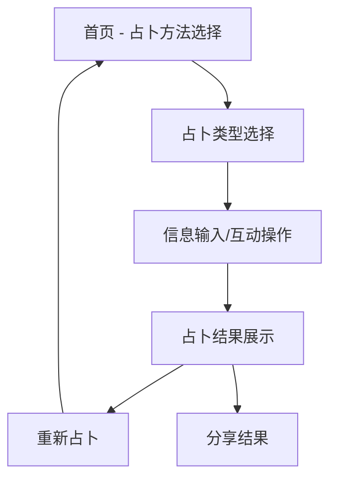

# 占卜应用功能扩展产品需求文档

## 1. 产品概述

本文档旨在规划和完善现有占卜应用的功能扩展，基于用户对塔罗占卜功能的满意反馈，进一步丰富占卜内容，提升用户体验。应用将涵盖西方占卜、东方占卜和心理测试三大类别，为用户提供全面、专业、个性化的占卜服务。

## 2. 核心功能

### 2.1 用户角色
本应用面向所有对占卜、命理、心理测试感兴趣的用户，无需区分用户角色，采用统一的用户体验设计。

### 2.2 功能模块

应用包含以下三大核心功能模块：

1. **西方占卜模块**：塔罗占卜、星座占星、数字命理
2. **东方占卜模块**：观音求签、问卦擲筊、八字命理、紫微斗数
3. **心理测试模块**：性格测试、配对打分、命格小故事

### 2.3 页面详情

| 页面名称 | 模块名称 | 功能描述 |
|----------|----------|----------|
| 首页 | 占卜方法选择 | 展示三大类别的占卜方法，用户可选择感兴趣的占卜类型 |
| 占卜类型页 | 运势类型选择 | 根据选择的占卜方法，提供爱情、事业、财富、健康、综合等运势类型 |
| 输入页面 | 信息收集与互动 | 根据不同占卜方法收集必要信息（如塔罗牌选择、出生信息、问题描述等） |
| 结果页面 | 占卜结果展示 | 显示详细的占卜结果，包含解读、建议、幸运元素等，支持复制和分享 |
| 西方占卜页 | 塔罗牌选择界面 | 提供22张大阿卡纳牌选择，支持1-5张牌的组合占卜 |
| 西方占卜页 | 星座信息输入 | 收集出生日期、时间、地点信息，进行星盘分析 |
| 西方占卜页 | 数字命理计算 | 基于姓名和生日计算生命数字，提供数字能量解读 |
| 东方占卜页 | 观音灵签抽取 | 模拟传统抽签过程，提供签诗和解读 |
| 东方占卜页 | 擲筊问卜 | 模拟擲筊过程，提供圣杯、笑杯、阴杯结果 |
| 东方占卜页 | 八字排盘 | 根据出生信息排出八字，分析五行属性和命理特征 |
| 东方占卜页 | 紫微斗数 | 生成紫微命盘，分析主要星曜影响和流年运势 |
| 心理测试页 | 性格分析 | 提供MBTI等性格测试，分析用户性格特质 |
| 心理测试页 | 配对测试 | 分析两人性格匹配度，提供关系建议 |
| 心理测试页 | 命格故事 | 基于用户信息生成个性化的人生故事和启示 |

## 3. 核心流程

### 用户操作流程

用户首先在首页选择感兴趣的占卜方法（西方、东方或心理测试），然后选择具体的运势类型（爱情、事业等），接着根据选择的占卜方法输入相应信息或进行互动操作，最后查看详细的占卜结果和建议。

## 4. 用户界面设计

### 4.1 设计风格

- **主色调**：深紫色(#6B46C1)和金色(#F59E0B)，营造神秘而高贵的氛围
- **辅助色**：深蓝色(#1E40AF)、翠绿色(#059669)、玫瑰金(#EC4899)
- **按钮样式**：圆角渐变按钮，具有悬停动效和点击反馈
- **字体**：主标题使用装饰性字体，正文使用易读的无衬线字体，字号16px-24px
- **布局风格**：卡片式设计，采用网格布局，支持响应式设计
- **图标风格**：线性图标配合填充图标，使用星座、塔罗、易经等主题元素

### 4.2 页面设计概览

| 页面名称 | 模块名称 | UI元素 |
|----------|----------|--------|
| 首页 | 占卜方法选择 | 三大类别卡片，每个卡片包含渐变背景、图标、标题和描述，悬停时有缩放动效 |
| 占卜类型页 | 运势类型选择 | 五个运势类型的圆形图标按钮，配有相应的Lucide图标和渐变色彩 |
| 塔罗输入页 | 塔罗牌选择 | 22张塔罗牌的网格布局，选中状态有金色边框和发光效果，支持多选 |
| 星座输入页 | 信息表单 | 日期时间选择器、地点输入框，采用现代化的表单设计 |
| 结果页面 | 结果展示 | 渐变背景卡片，包含占卜结果文本、复制按钮、重新占卜按钮，支持滚动查看 |
| 东方占卜页 | 抽签界面 | 传统签筒动画效果，点击抽签有摇晃动画，签条飞出效果 |
| 擲筊页面 | 擲筊动画 | 3D擲筊动画效果，显示擲筊结果的视觉反馈 |
| 心理测试页 | 测试问卷 | 现代化的问卷界面，进度条显示，选项卡片化设计 |

### 4.3 响应式设计

应用采用移动端优先的响应式设计，在手机、平板和桌面端都能提供良好的用户体验。针对触屏设备优化了交互操作，如塔罗牌选择、擲筊动画等。

## 5. 功能优化建议

### 5.1 西方占卜优化

**塔罗占卜**
- 扩展到完整的78张塔罗牌（22张大阿卡纳 + 56张小阿卡纳）
- 增加不同的牌阵布局（如凯尔特十字、三牌阵等）
- 提供逆位牌的解读
- 添加塔罗牌的视觉图像

**星座占星**
- 集成真实的天体运行数据
- 提供完整的星盘分析
- 增加行星相位解读
- 添加每日/每周/每月运势预测

**数字命理**
- 完善生命数字计算算法
- 增加姓名数字学分析
- 提供数字组合的深度解读
- 添加幸运数字和颜色推荐

### 5.2 东方占卜优化

**观音求签**
- 扩展到100签的完整签谱
- 增加签诗的古文注释
- 提供不同版本的签文解读
- 添加求签的仪式感动画

**八字命理**
- 完善八字排盘算法
- 增加大运、流年分析
- 提供五行喜忌建议
- 添加改运方法指导

**紫微斗数**
- 完整的紫微命盘生成
- 108颗星曜的详细解读
- 十二宫位的深度分析
- 流年运势的精准预测

### 5.3 心理测试优化

**性格测试**
- 集成多种权威性格测试（MBTI、九型人格、大五人格等）
- 提供详细的性格报告
- 增加职业匹配建议
- 添加性格发展指导

**配对打分**
- 多维度匹配分析（性格、价值观、生活方式等）
- 提供关系改善建议
- 增加沟通技巧指导
- 添加情感发展预测

**命格小故事**
- AI生成个性化人生故事
- 结合用户的真实信息
- 提供人生阶段分析
- 增加未来发展建议

## 6. 技术实现要点

### 6.1 数据完善
- 建立完整的占卜数据库（塔罗牌、星座、八字等）
- 优化算法逻辑，提高结果的准确性和个性化
- 增加随机性和变化性，避免重复结果

### 6.2 用户体验
- 增加动画效果和交互反馈
- 优化加载时间和响应速度
- 提供结果保存和历史记录功能
- 增加社交分享功能

### 6.3 内容质量
- 聘请专业占卜师审核内容
- 定期更新和优化解读文本
- 增加多语言支持
- 提供个性化推荐

## 7. 发展规划

### 7.1 短期目标（1-3个月）
- 完善现有功能的用户界面和交互体验
- 扩充占卜数据库和解读内容
- 优化结果生成算法
- 增加用户反馈收集机制

### 7.2 中期目标（3-6个月）
- 集成AI技术，提供更智能的解读
- 增加用户账户系统和历史记录
- 开发移动端应用
- 建立用户社区功能

### 7.3 长期目标（6-12个月）
- 引入专业占卜师在线咨询服务
- 开发付费高级功能
- 扩展到国际市场
- 建立占卜知识学习平台

通过以上功能扩展和优化，占卜应用将为用户提供更加丰富、专业、个性化的占卜体验，满足不同用户的需求，建立在占卜领域的竞争优势。